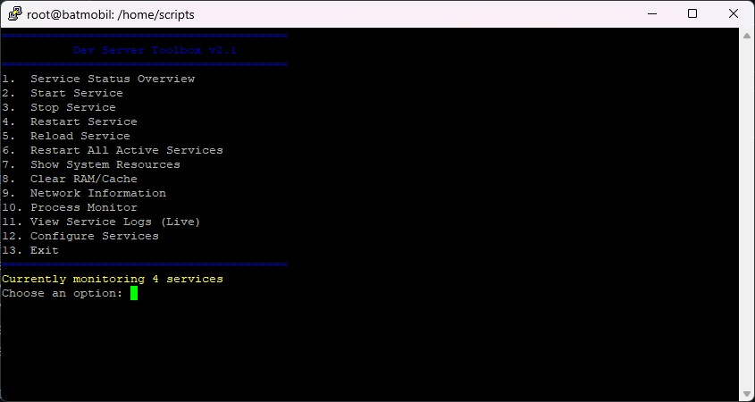

# Developer Server Toolbox 
##### v2.1 

A lightweight, interactive Bash tool for developers to manage and monitor Linux servers. Can also be used as a boilerplate.

If you have 20 to 50 services, you’ll quickly see how easy life gets with this tool — no more manual restarts or rebooting whole infrastructures.

This interactive Bash script is your go-to helper for quick DevOps tasks, local development environments, or small server setups. It’s built to simplify service management and system monitoring right from your terminal.
##  Key Features

  - **Service Management**: Easily view, start, stop, restart, or reload your most critical services with a simple command.
  - **System Monitoring**: Get a real-time snapshot of your server's resources, including memory, disk, and CPU usage.
  - **Live Logs**: Troubleshoot on the fly by viewing a service's logs in real time.
  - **Maintenance Tools**: Perform quick maintenance tasks like clearing system cache to free up memory.
  - **Customizable Service List**: Adapt the list of monitored services to your specific needs, all within the script's menu.

-----

##  Installation & Usage

1.  **Download the script**
    Save the code to a file named `server-toolbox.sh`.

    ```bash
    # Make the script executable
    chmod +x server-toolbox.sh
    ```

2.  **Run the script**

    ```bash
    ./server-toolbox.sh
    ```

    The main menu will appear in your terminal, and you can select an option by entering its number.

-----

##  Detailed Menu Options

###  Service Status Overview

This option provides a clear, color-coded overview of all configured services:

  - **`●` (green):** The service is **active** and running.
  - **`○` (red):** The service is **inactive**.
  - **`✗` (red):** The service is **not installed** on your system.

### 2-5. Service Actions (Start, Stop, Restart, Reload)

Selecting one of these options presents a list of all services from your configuration. Simply enter the number of the service you want to manage.

> **Note on `Start`:** If you start a service that is not enabled to run on boot, the script will prompt you to enable it. This is a handy shortcut that saves you from running a separate `systemctl enable` command.

###  Restart All Active Services

This is a powerful function for bulk actions. It iterates through your entire service list and restarts only those that are currently active. This is especially useful after system updates or configuration changes that require multiple services to be reloaded.

###  Show System Resources

Get a quick look at your server's health:

  - **Memory Usage:** Shows RAM and swap usage with `free -h`.
  - **Disk Usage:** Displays disk space usage for all mounted file systems with `df -h`.
  - **CPU & Load Average:** Provides system uptime and average load with `uptime`.
  - **Top Processes:** Lists the most CPU and memory-intensive processes.

### Clear RAM/Cache

This option helps you instantly free up memory by clearing the system cache. It runs the commands `sudo sync` and `sudo sysctl vm.drop_caches=3` to flush the cache.

###  Network Information

Displays essential network details:

  - **Active Connections:** Lists all active listening ports and connections with `ss -tuln`.
  - **Network Interfaces:** Shows your network interfaces and their IP addresses with `ip -br addr show`.

### 10\. Process Monitor

This provides a more focused view of process activity. It shows two lists:

  - The top processes sorted by **CPU usage**.
  - The top processes sorted by **memory usage**.

###  View Service Logs (Live)

An indispensable tool for debugging. This option lets you choose a service and watch its logs in real time using `sudo journalctl -u [service] -f`. To exit the live log view, simply press **`CTRL+C`**.

###  Configure Services

This menu allows you to dynamically manage the list of services monitored by the script:

  - **Add Service:** Add a new service name to the list.
  - **Remove Service:** Remove a service by its number.
  - **Reset to Default:** Restore the list to the original configuration (`apache2`, `mariadb`, `tor`, `ssh`).

> **Important:** Changes made via this menu are **temporary** and will be lost when you exit the script. For a permanent change, you must directly edit the `SERVICES` array variable at the top of the `server-toolbox.sh` script file.

###  Exit

Gracefully exits the script.

-----

### Screnshot



##  Requirements & Dependencies

  - A Linux system with `systemd` is required.
  - **`sudo` privileges** are needed for most service management actions.
  - The script relies on the following standard Linux commands, which are typically pre-installed: `systemctl`, `ss`, `ip`, `df`, `free`, `uptime`, `top`, `ps`, and `journalctl`.

-----

##  License

This project is licensed under the GPL 3 License. You are free to modify, distribute, or integrate it into your own tools.
